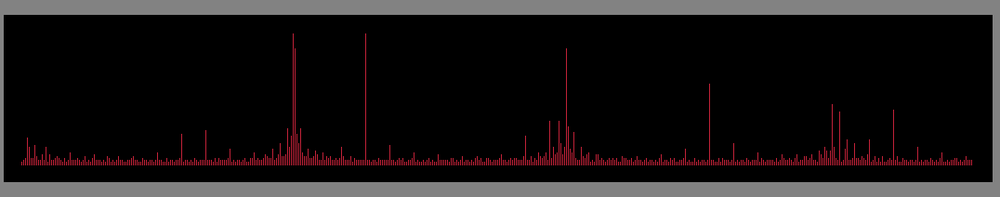

# A Simple Synthesizer written in C using raylib and minfft

This program implements a simple virtual synthesizer that turns the computer keyboard 
into a one-octave piano. Each key press generates an audio signal for the corresponding 
musical note (C to C, including the sharp notes). 
The generated waveform is processed using a Fast Fourier Transform (FFT) to obtain its 
frequency spectrum, which is visualized in real time on the screen.

Used libraries:
- https://github.com/aimukhin/minfft/blob/master/minfft.c 
- https://www.raylib.com/

To run the program:
1. Clone the repository
2. Inside the repo run the following commands (UNIX) :
   ```bash
   mkdir build
   cd build
   cmake ..
   cmake --build .
   ./src/synth
   ```
The keyboard for the synthesizer is mapped to the following keys:
<pre> E R   Z U I
S D F G H J K L</pre>

  
With the keys **1-4** different filters can be applied to the signal.


